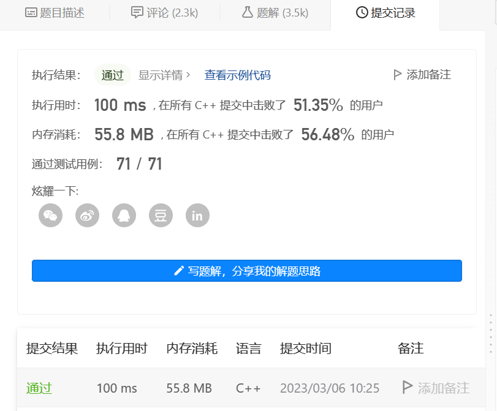
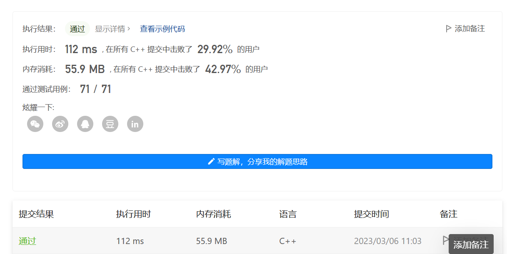
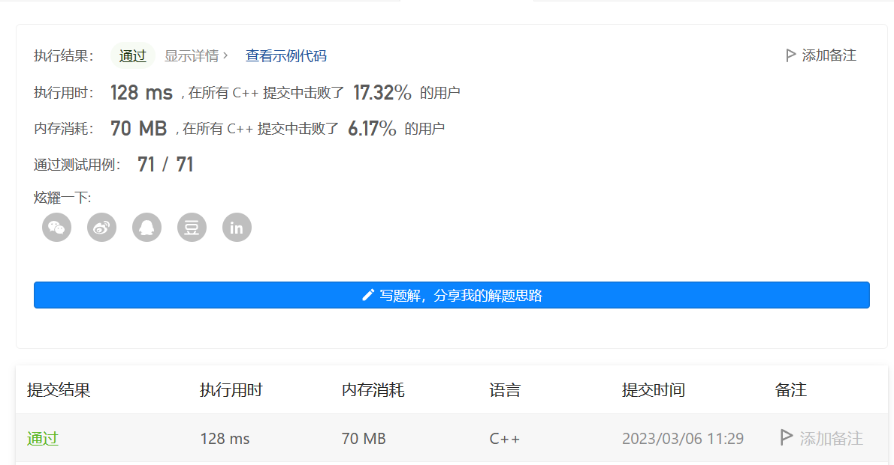

第一版：采用先排序再遍历的方法，复杂度为$O(nlog(n))$<br>
```
class Solution {
public:
    static bool containsDuplicate(std::vector<int>& nums) {
    sort(nums.begin(),nums.end());
    int prior=nums[0];
    for(int i=1;i<nums.size();i++)
    {
        if(nums[i]==prior) return true;
        else prior=nums[i];
    }
    return false;
    }
};
```
<br>

第二版：把下标遍历改为了迭代器遍历，但实话说并没有觉得变得方便,并且性能变差了<br>
```
class Solution {
public:
    static bool containsDuplicate(std::vector<int>& nums) {
    sort(nums.begin(),nums.end());
    for(auto iter=nums.begin();iter!=nums.end()-1;)
    {
        if((*iter)==*(++iter)) return true;
    }
    return false;
    }
};
```


第三版：换思路使用Hash Table。结果更慢了，拉倒吧，去吃饭了。
```
class Solution {
public:
    static bool containsDuplicate(std::vector<int>& nums) {
        std::unordered_set<int> a;
        for(int x:nums){
            a.insert(x);
        }        
        if(a.size()!=nums.size()) return true;
        else return false;
    }
};
```

